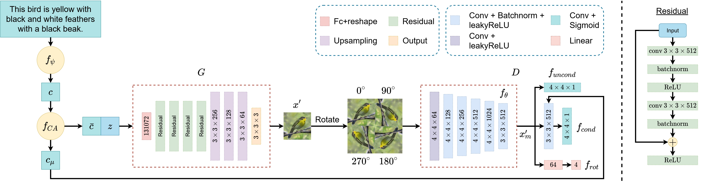
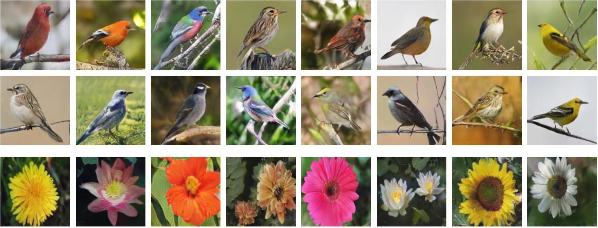

# Text-to-image synthesis with self-supervised learning

This repository contains the **pytorch** code for the paper: "[Text-to-image synthesis with self-supervised learning](https://doi.org/10.1016/j.patrec.2022.04.010)" Yong Xuan Tan, Chin Poo Lee, Mai Neo, Kian Ming Lim



## Environment
The code is tested on Windows 10 with Anaconda3 and following packages:
- python 3.7.11
- pytorch 1.9.0

## Dataset
1. Download the preprocessed char-CNN-RNN text embeddings for [flowers](https://www.dropbox.com/sh/g8rmz41xblaszb1/AABPNtIcLu1fKNoBsJTHJTIKa?dl=0) and [birds](https://www.dropbox.com/sh/v0vcgwue2nkwgrf/AACxoRYTAAacmPVfEvY-eDzia?dl=0) and put them into `./data/oxford` and `./data/cub` folder.

2. Download the [flowers](http://www.robots.ox.ac.uk/~vgg/data/flowers/102/) and [birds](http://www.vision.caltech.edu/datasets/cub_200_2011/) images and put them into `./data/oxford` and `./data/cub` folder.

3. The dataset organization can be viewed in `data` folder.

## Experiments
To train on CUB:<br/>
```
python main.py --dataset birds --exp_num cub_exp1
```
To evaluate on CUB:<br/>
```
python main.py --dataset birds --exp_num cub_exp1 --is_test true
```

## Pre-trained Models
Download the [pretrained models](https://drive.google.com/file/d/1hvgiqtjJFBpHalkbqGxzr6ZiWD2lZLup/view?usp=drive_link). Save them to the `saved_model` folder.

Examples generated by SSTIS:


## Citation
If you find this repo useful for your research, please consider citing the paper:
```
@article{TAN2022119,
  title = {Text-to-image synthesis with self-supervised learning},
  journal = {Pattern Recognition Letters},
  volume = {157},
  pages = {119-126},
  year = {2022},
  issn = {0167-8655},
  doi = {https://doi.org/10.1016/j.patrec.2022.04.010},
  author = {Yong Xuan Tan and Chin Poo Lee and Mai Neo and Kian Ming Lim},
}
```

## Our follow-up work
[Text-to-image synthesis with self-supervised bi-stage generative adversarial network](https://doi.org/10.1016/j.patrec.2023.03.023) [[code]](https://github.com/Jityan/SSBiGAN)

## Contacts
For any questions, please contact: <br/>

Yong Xuan Tan (yongxuan95@gmail.com) <br/>
Jit Yan Lim (jityan95@gmail.com)

## Acknowlegements
- [Text-to-Image Synthesis](https://github.com/aelnouby/Text-to-Image-Synthesis)
- [StackGAN](https://github.com/hanzhanggit/StackGAN)
- [HDGAN](https://github.com/ypxie/HDGan)
- [SS-GAN](https://github.com/vandit15/Self-Supervised-Gans-Pytorch)

## License
This code is released under the MIT License (refer to the LICENSE file for details).
